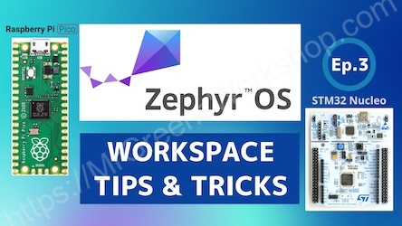

### How to create Zephyr OS Workspace with device drivers for Raspberry Pi Pico(RP2040) and other boards like STM32 Nucleo and VS Code Setup.

---

Everything about Zephyr OS Workspaces is covered in [this YouTube video](https://youtu.be/twgPd9IQl88).

<!--
- Check this Blog post
  - https://www.mrgreensworkshop.com/posts/xxxxx
-->

### Manifest files

- For workspace apps
  - Raspberry Pi Pico RP2040 (Zephyr board name: rpi_pico)
    - [manifests/rpi_pico](/manifests/rpi_pico)

  - STM32 boards like ST NUCLEO F302R8 and more (Zephyr board name: nucleo_f302r8)
    - [manifests/stm32](/manifests/stm32)

    The provided manifest files contain only the minimum required modules to compile [example-application](https://github.com/zephyrproject-rtos/example-application/).
    
- For freestanding apps
  - You don't need Manifest files.
  
### VS Code workspace settings

- Raspberry Pi Pico RP2040 (Zephyr board name: rpi_pico)
  - For workspace apps
    - [workspace_apps/.vscode](/vscode_settings/rpi_pico/workspace_apps/.vscode/)
  - For freestanding apps
    - [freestanding_apps/.vscode](/vscode_settings/rpi_pico/freestanding_apps/.vscode/)
    
  The provided ".vscode/launch.json" file is required for Raspberry Pi Pico RP2040 debugging. For other boards, you are on your own.

- Other boards
  - For workspace apps
    - You don't need VS Code Workspace Settings.
  - For freestanding apps
    - [freestanding_apps/.vscode](/vscode_settings/other_boards/freestanding_apps/.vscode/)

  You can use these ".vscode" settings to build your apps in VS Code. These settings work on almost any board, unless you need other dependencies.
  ".vscode" settings tested on MacOS (Ventura 13.2), Linux (Ubuntu 22.04) and Windows (10).

### You Can Support My Work

Creating projects like this takes a great amount of time. Much appreciated if you consider supporting me so that I can continue projects like this and creating new contents for everyone.

- You can support me on [GitHub Sponsors](https://github.com/sponsors/MrGreensWorkshop "Support me on GitHub Sponsors") (monthly or one time)
- You can be one of my patrons on [Patreon](https://patreon.com/MrGreensWorkshop "Be my Patron") (monthly)
- You can tip me via [Ko-fi](https://ko-fi.com/MrGreensWorkshop "Tip Me via Ko-fi") (one time)

### License

As it says in the [Apache License 2.0](https://github.com/MrGreensWorkshop/ZephyrOS_manifests_and_vscode_settings/blob/main/LICENSE.txt), you can use my code anywhere as long as you include the license file and copyright notice. Also, state if you make any changes.

`Copyright (c) 2022 Mr. Green's Workshop https://www.MrGreensWorkshop.com`

Please add link to my page so I can get credit for my work.

Thank you!